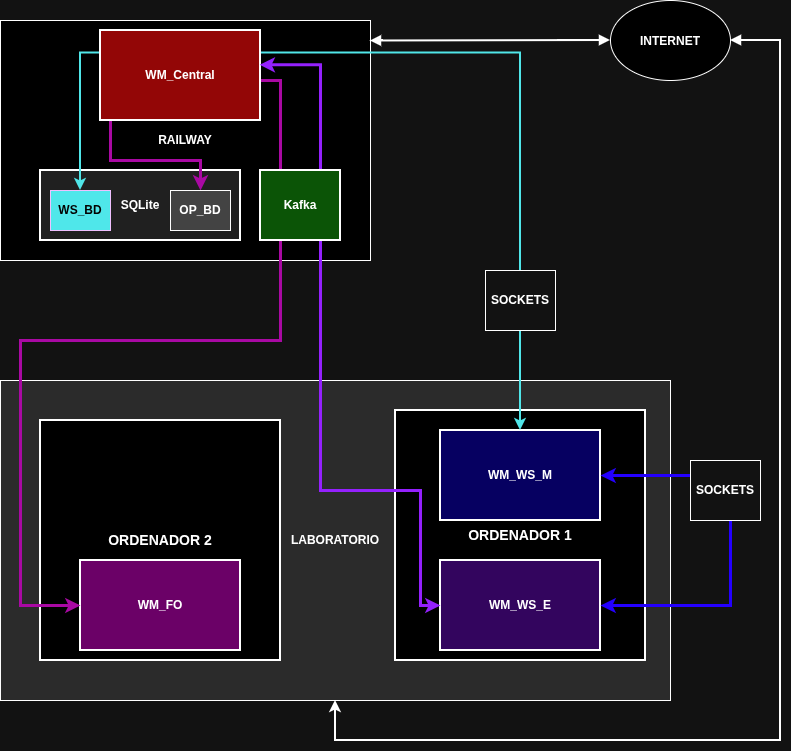

# Arquitectura del sistema

La aplicación **WaterManagement Network** está formada por varios componentes
distribuidos que se comunican mediante dos mecanismos principales:

- **Sockets**, utilizados para comunicaciones directas entre determinados módulos.
- **Kafka**, utilizado como middleware para las comunicaciones basadas en eventos.

El sistema se despliega en dos entornos principales:

- **Railway**, donde se alojan los servicios centrales.
- **Laboratorio**, donde se ejecutan las aplicaciones de los operarios y las
  Watering Stations.

---

## 1. Diagrama de arquitectura

El diagrama muestra conjuntamente los principales componentes del sistema, sus
mecanismos de comunicación y su distribución entre Railway y el laboratorio.

---

## 2. Componentes y responsabilidades

### WM_Central

Es el componente central del sistema.

Se encarga de gestionar la información global de las Watering Stations y de
coordinar las solicitudes de servicio procedentes de los Field Operators.

También mantiene la comunicación con los monitores de las Watering Stations
para su autenticación, validación y recepción de incidencias.

### WM_FO — Field Operator

Es la aplicación utilizada por los operarios del sistema.

Permite solicitar servicios de suministro y comunicarse con `WM_Central`
mediante el sistema de mensajería basado en Kafka.

La aplicación puede solicitar servicios de forma puntual o leer de un fichero
los servicios que debe solicitar.

### WM_WS_M — Monitor

Es el componente encargado de supervisar una Watering Station.

Al iniciarse, se conecta con `WM_Central` para autenticarse y validar que la
estación está preparada para prestar servicios.

También establece una conexión con el `WM_WS_E` asociado y realiza
comprobaciones periódicas de su estado.

Si el Engine no responde o devuelve un estado `KO`, el Monitor comunica la
avería a `WM_Central`.

### WM_WS_E — Engine

Es el componente que implementa la lógica principal de funcionamiento de una
Watering Station.

Permanece a la espera de solicitudes de servicio procedentes de `WM_Central`
mediante el gestor de colas y ejecuta la lógica necesaria para atenderlas.

También responde a las comprobaciones de estado realizadas por su Monitor.

### Kafka

Actúa como middleware para las comunicaciones basadas en eventos.

Los componentes que utilizan este mecanismo publican y consumen mensajes a
través del broker, evitando una comunicación directa mediante sockets.

### SQLite

Es la base de datos utilizada para mantener la información persistente
necesaria para el funcionamiento del sistema.

---

## 3. Despliegue

El sistema se despliega en dos entornos: **Railway** y el **laboratorio**.

### 3.1 Railway

En Railway se alojan:

- `WM_Central`
- SQLite
- Kafka

### 3.2 Laboratorio

En el laboratorio se ejecutan:

- Varias instancias de `WM_FO`.
- Varias Watering Stations, formadas por:
  - `WM_WS_M`
  - `WM_WS_E`

El escenario mínimo contempla varios `WM_FO` en un ordenador y varios `WM_WS`
en otro ordenador.

### 3.3 Docker

El proyecto establece el uso obligatorio de Docker para el despliegue de los
módulos.

A nivel de nuestra aplicación se contemplan inicialmente:

- Contenedor `WM_Central`
- Contenedor `WM_FO`
- Contenedor `WM_WS_M`
- Contenedor `WM_WS_E`

---

## 4. Comunicaciones

### 4.1 Comunicaciones mediante sockets

Se utilizarán sockets para las comunicaciones directas entre:

- `WM_WS_M ↔ WM_Central`
- `WM_WS_M ↔ WM_WS_E`

#### WM_WS_M ↔ WM_Central

El Monitor se conecta con `WM_Central` para autenticarse y validar la
Watering Station.

Además, el Monitor comunica a la Central las incidencias detectadas en la
estación.

#### WM_WS_M ↔ WM_WS_E

El Monitor establece una conexión con el Engine de su propia Watering Station.

Una vez conectados, el Monitor realiza periódicamente comprobaciones del
estado del Engine.

Si no recibe respuesta o recibe una respuesta `KO`, comunica la incidencia
a `WM_Central`.

---

### 4.2 Comunicaciones mediante Kafka

Kafka se utilizará como middleware para las comunicaciones basadas en eventos.

Las principales comunicaciones previstas son:

- `WM_FO → Kafka → WM_Central`
- `WM_Central → Kafka → WM_FO`
- `WM_Central → Kafka → WM_WS_E`
- `WM_WS_E → Kafka → WM_Central`

---

### 4.3 Dirección de las comunicaciones

#### Sockets

| Origen | Destino | Mecanismo | Finalidad |
|---|---|---|---|
| `WM_WS_M` | `WM_Central` | Sockets | Registro, autenticación y comunicación de incidencias |
| `WM_Central` | `WM_WS_M` | Sockets | Respuestas y confirmaciones |
| `WM_WS_M` | `WM_WS_E` | Sockets | Comprobación del estado del Engine |
| `WM_WS_E` | `WM_WS_M` | Sockets | Respuesta a las comprobaciones |

#### Kafka

| Origen | Intermediario | Destino | Finalidad |
|---|---|---|---|
| `WM_FO` | Kafka | `WM_Central` | Solicitudes de suministro |
| `WM_Central` | Kafka | `WM_FO` | Comunicación del resultado de las solicitudes |
| `WM_Central` | Kafka | `WM_WS_E` | Solicitudes de servicio |
| `WM_WS_E` | Kafka | `WM_Central` | Comunicación de eventos y resultados |

> Estas direcciones representan el diseño inicial.

---

### 4.4 Comunicación síncrona y asíncrona

El sistema combina ambos modelos de comunicación.

#### Comunicación síncrona

Las comunicaciones mediante sockets pueden utilizar un modelo de
**petición-respuesta** cuando una operación requiere una respuesta inmediata.

Por ejemplo:

- Autenticación y validación entre `WM_WS_M` y `WM_Central`.
- Comprobación de estado entre `WM_WS_M` y `WM_WS_E`.

En estas operaciones, el emisor espera la respuesta correspondiente antes de
continuar con esa operación.

#### Comunicación asíncrona

Las comunicaciones mediante Kafka seguirán un modelo basado en eventos.

El productor publica un mensaje en Kafka y el consumidor puede procesarlo
posteriormente sin mantener una comunicación directa con el productor.

Este modelo proporciona un mayor desacoplamiento temporal entre los componentes.

---

## 5. Persistencia

### 5.1 SQLite

El proyecto establece el uso obligatorio de SQLite para la implementación.

La base de datos se utilizará para almacenar la información persistente
necesaria para el sistema.

### 5.2 Estructura provisional

Como primera propuesta, se plantea almacenar:

#### Operarios

- `id`
- `nombre_usuario`

#### Watering Stations

- `id`
- `estado`
- `ubicacion`

> **Provisional:** esta estructura podrá modificarse cuando se hayan definido
> completamente los requisitos de persistencia y los estados de las
> Watering Stations.

---